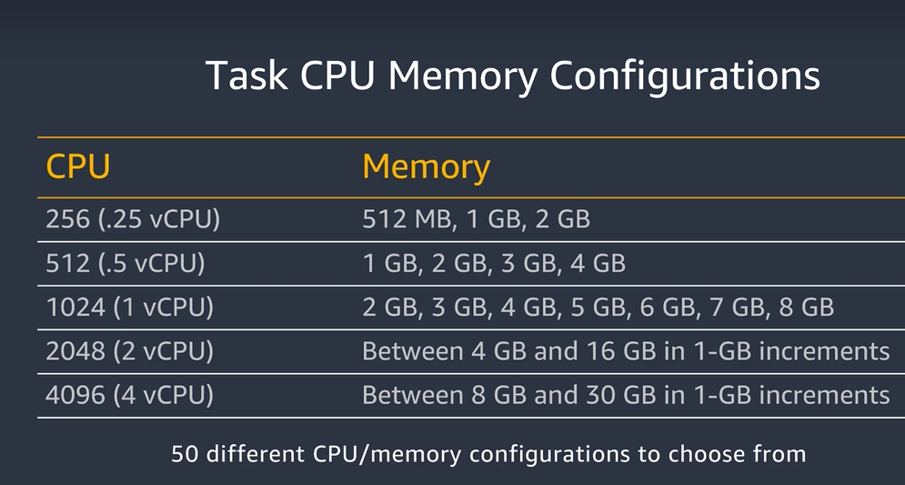
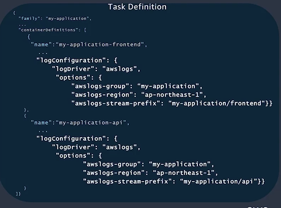
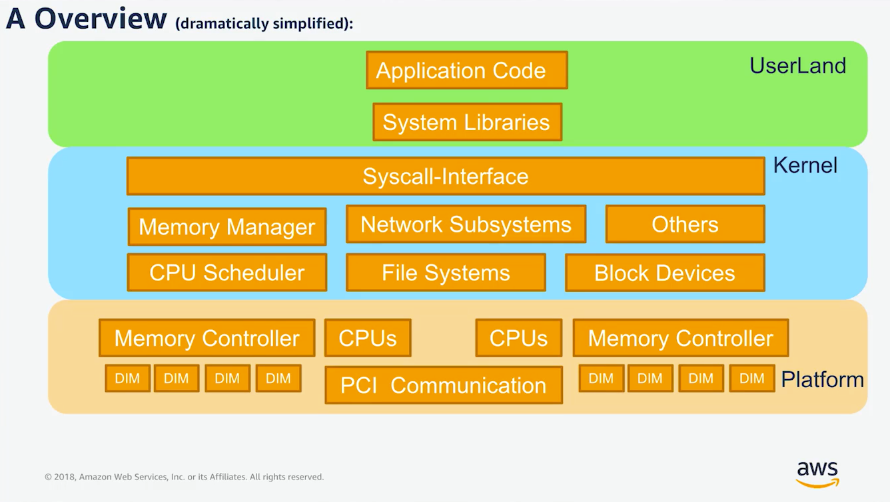
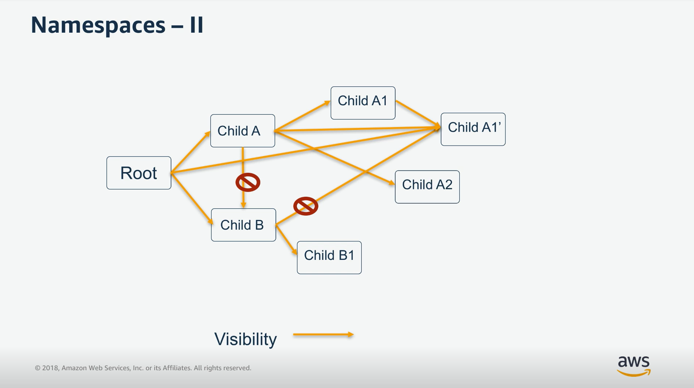
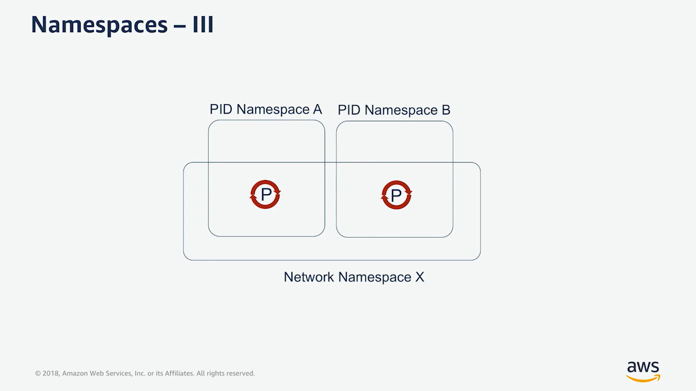
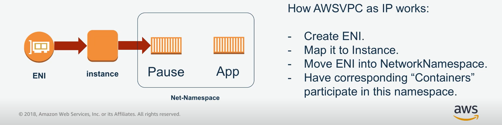

# Developer Learning Plan
https://explore.skillbuilder.aws/learn/lp/84/developer-learning-plan

## Introduction to Container

Inefficient Way
Bare Metal Servers > Server Hardware > Operating System > Libraries > Application A, B, C

Virtual Machine > Server Hardware > OS > Virtialization Platform > VMs

Containers > Server Hardware > OS > Containerization Platform > Libraries > Shared Libraries

Docker Benefits:
1- Portable
2- Package in images
3- Different versions are supported
4- Faster


To build your own image we need to create a Dockerfile to create the image

A simple docker file:
``` Dockerfile
From ubuntu:latest
CMD echo "Hello world"
```

This is to run a java code:
``` Dockerfile
FROM openjdk:8
COPY /hello.jar /usr/src/hello.jar
CMD java -cp /usr/src/hello.jar org.example.App
```

Each command within a docker file creates a layer within the image which is **immutable**:

``` Dockerfile
FROM centos:7 => first layer

RUN yum -y update && yum -y install httpd => second layer

EXPOSE 80 => third layer

ADD run-httpd.sh /run-httpd.sh => fourth layer
RUN chmod -v +x /run-httpd.sh => last layer

CMD ["/run-httpd.sh"]
```

Each layer has a thin read/write layer on top of the existing image when it is instantiated. The underlying image remains unchanged.


### Microservice Architecture
This is designed to speed up the deployment side. In microservice architecture we have the ability to start fast, fail fast and recover fast.

The characterstics of microservices:
1- Decentrialized
2- Smart endpoints, dumb pipes => service should be smart
3- Independent products => each microservice is a independent product
4- Designed for failure => services should be resilient to handle bad input
5- Disposability => Anything breaks should be recovered fast. Add and remove containers easily
6- Development and production parity => The program that works on developers system should work the same on production system too.


## Introduction to AWS Fargate
What is fargate? It is a new technology to deploy and manage the containers. 

1- With Fargate you don't need to provision and scale the servers and your clusters
2- You don't need to patch and update the underlaying infrustructure.
3- Fargate supports both ECS (Elastic Container Service) and EKS (Elastinc Kube Service)
4- We can choose the orchetration solutions based on ECS and EKS
5- With Fargate only you use based on what you use.
6- Fargate is easy to use for all types of users on AWS
7- We can use Fargate through AWS Management Console, AWS CLI, AWS ECS CLI
8- In Fargate we can choose our CPU and Memory usage
9- This would allow us to run a container behind an nginx in our environment.


Differences between Fargate and EC2:
1- All tasks run in virtual cloud on a VPC that we decide. We can define which VPC, what subnets and which security conditions to apply.
2- Fargate enforces the configuration once the tasks are started.
3- Fargate supports both ALB (Application Load Balancing) and NLB (Network Load Balancing) and to this date ELB (Elastic Load Balancing) is not supported by Fargate.
4- Fargate supports advanced task level networking which makes it to have security groups and monitoring tools

Fargate Security:
1- Tasks can be accessed by the ones who own the task
2- No SSH accesss to the infrustructure
4- Isolated cluster

When to use EC2 instead of Fargate:
1- If you're a heavier user of EC2 spot or paied for the instances
2- If our app is running on windows

Amazon services:
1- ECS to manage and launch containers on AWS
2- EKS uses Kubernetes
3- ECR is the registry to store containers


## Deep Dive on AWS Fargate
https://explore.skillbuilder.aws/learn/course/103/play/458/deep-dive-on-aws-fargate-building-serverless-containers-at-scale;lp=84

Benefits of Fargate:
1- Managed by AWS
2- Elastic
3- Integrated with AWS echosystem

In Fargate you need to first define:
1- Image
2- URL
3- CPU
4- Memory
5- etc.

Then you need to define the cluster you need. Cluster is a logical boundry and inside the cluster we run our tasks. Each might have one to 10 containers. 

Fargate allows us to run services within a cluster which uses elastic load balancing. Also, unhealthy tasks would be automatically replaced.

To define a task we need to have a json snippet to run the task. This snippet is a json file that contains the cpu needed for that task, and an array which contains the memory definition for each container. There we can mention how much cpu we need for each container and how much memory is needed. Also, there we should declare which image we are going to use.

Fargate has 50 different configurations among resources:



Also, it has networking configurations to be setup:
1. Create an ENI (Elastic Network Interface)
2. The ENI ins allocated a private IP from subnet
3. The ENI is attached to our task
4. Your task now has a private IP
5. If we need the task to be accessed or have access to the internet we still can setup inbound and outbound traffic
6. the network can be defined as networkMode in task config

Layer storage can be shared among the tasks:
1. 10 Gb of storage is available per task which is shared across all containers, including image layers.
2. Keep in mind that the writable layer is not visible in containers and they have to be setup in the container.

Volume storage:
1. If we need to have shared writable among containers AWS provides 4 Gb disk space among containers per task
2. This volume can be mounted to each container which can be mounted to different containerPaths
3. We should not specify host sourcePath
4. This shared storage is ephemoral meaning that once the task is stopped all the data would be deleted automtically.
5. according to 4 if we need to persist our data we need to design the architecture somehow to push the data to S3 before task being closed.

IAM Permissions:
1. Cluster permission: defines that who can describe/launch tasks within the cluster
2. Application permissions: Allows your application containers to access AWS resources securely
3. Housekeeping permissions: Allows us to perform image pull, cloudwatch logs, ENI creation, register/deregister targets into elastic load balancing.

Housekeeping Permissions:
1. Certain permissions are needed to bootstrap the task and keep it running
2. Execution role: ECR Image Pull, Pushing Logs, 
3. ECS Service Linked Role: ENI management, ELB Management

Visibility and Monitoring:
1. We can push our logs directly to CloudWatch
2. Use awslogs to send stdout logs from application to CloudWatch logs
3. Create a log group in CloudWatch
4. Configure the log driver in your task definition



5. Having access to task cpu and memory utilization on CloudWatch on AWS.


Task Metadata:
1. Query environmental data and stats for the running task within the task
2. We can have access endpoint data such as task level and container level. this can be done through the ip namespace like:
    - <IP>/v2/metadata
    - <IP>/v2/stats
    - <IP>/v2/metadata/<container-id>
    - <IP>/v2/stats/<container-id>

Managed Service Discovery for ECS:
1. Service Registery -> This helps us to have updated list of registerd services with their IP and port
2. Highly available and scalable
3. Flexible for auto discovery

Service Registry with Route 53:
1. Define namespace
2. CNAME per service
3. A records per task IP
4. SRV record per task IP + port

Practical Demo:
1. First we need to create new cluster to deploy our application.
```bash
aws ecs create-cluster --cluster-name pictshare --region ap-southeast-2
```

2. Then we need to define a task with task_definition.json:

``` json
{
    "family": "pictshare",
    ...
    "containerDefinition: [
        ...
    ]
}
```

3. Then we need to push our config to aws:

``` bash
aws ecs register-task-definition \
--cli-input-json file://task_definition.json \
--region ap-southeast-2 --query 'taskDefinition.taskDefinitionArn'
```

4. Then we need to configure our service with service.json:

```json
{
    "cluster": "name",
    "serviceName": "name",
    "taskDefinition": "name:1",
    "desiredCount": 1,
    "launchType": "FARGATE",
    "platformVersion": "LATEST",
    "loadBalancers": [
        {
            "targetGroupArn": "arn:aws:elasticloadbalancing:ap-souteeast-2....",
            "containerName": "name:",
            "containerPort": 80,
        }
    ],
    "networkConfiguration": {
        "awsvpcConfiguration": {
            "subnets": ["subnet", "subnet-2"],
            "securityGroups": ["sg-1"],
            "assignPublicIp": "ENABLED"
        }
    }
}
```

5. To push these configuration we should use the following:

``` bash
aws ecs create-service --cli-input-json file://service.json
```

If there are no errors it means that the service is created successfully


6. then we need to start writing autoscaling configuration:

```bash
aws application-autoscaling register-scalable-target --resource-id service/name/name --service-namespace ecs --scalable-dimension ecs:service:DesiredCount --min-capacity 1 --max-capacity 20 --role-arn arn:---:--- 
```

7. Then we need to define scaling out dimensions by using another json file called scale-out.json:

```json
{
    "PolicyName": "name",
    "ServiceNamespace": "ecs",
    "ResourceId": "service/name/name",
    "ScalableDimension": "ecs:service:DesiredCount",
    "PolicyType": "TargetTrackingScaling",
    "TargetTrackingScalingPolicyConfiguration": {
        "TargetValue": 50,
        ...
    } 
    ...
}
```
Here it mentions that according to cpu utilization how much we need to scale in or scale out.

8. Then we need to deploy those configurations:

```bash
aws application-autoscaling put-scaling-policy --cli-input-json file://scale-out.json
```

9. To make sure that our repository changes would restart the services and update the code we need to first createa a repository on codecommit:

```bash
aws codecommit create-repository --repository-name name
```

10. Then we need to create a code build project:

``` bash
aws codebuild create-project \
--name "name" \
--description "Build project for name" \
--source type="code-pipeline" \
...
```

we can also create a codepipeline with passing a json document like all other instances that we have created.

11. Then we need to create a code commit build which can trigger our service to pull the new container once the build is completed. This needs to create an event which triggers the pipeline

``` bash
aws events put-rule \
--cli-input-json file://event_put_rule.json
```

## Dive Deep on Container Security
https://explore.skillbuilder.aws/learn/course/72/deep-dive-on-container-security;lp=84

This is a base talk for contianer security

Risks
- Segregation (Confidentiality)
    - Container to Container
    - Process to Process
    - Container to Outside


- Access
    - Who/When/Where
    - Logging
    - Start/Stop
    - Content

- Resource Usage

Here is an overview how the computer system works and has different layers:



If we have many applications we need to have:
- Efficient CPU usage
- Efficient Memory Usage
- Compression
- Quick
- Agile
- Lightweight

The applications in different containers are using the same kernel meaning they use all features from OS which are shared and their segragation is really important. 

There are several namespaces:

- Namespace - I
    - PID-Namespace
    - CPU/Memory-Namespace (cgroup)
    - Network-Namespace
    - User-Namespace
    - FS/Mount-Namespace
    - IPC-Namespace
    - UTS Namespace

To start a Namespace, you need to clone(2) system call.

- Namespace - II
    - Namespaces are organized in a tree strucutre:
    - 

- Namespace - III
    - For example, we can have multiple processes in different namespaces which they cannot see each others' information, however, they can have shared network namespace. 
    - 

- PID/Process Namespace:
    - Each process has a global and local PID -> From the Kernel we can see both gloabl and local PID but from the local stand point we only can see local PID.
    - The processes of different namespaces cannot see each other.
    - 1st proces in a new namespace has PID1, others are linked to it in a tree structure.
    - Modifying a process or killing a process is possible in the same namespace or child.
    - STILLLLL, all on the same memory management. -> It is important to note that the relationship between the memory and the processes is important.
    - Use clone(2) to get in. Do not install open-ssh inside the container and login!
    - Fork(2) is available inside.

- CPU/Memory (cgroups):
    - Policy-based scheduling
    - CPU Affinity possible, but not always encforced ->CPU affinity enables binding a process or multiple processes to a specific CPU core in a way that the process(es) will run from that specific core only.
    - Memory limitation is difficult (Out of memory, or oom killer) -> If the memory gets extended and goes over the memory limit which causes problems. Also, container can use more memory even if we put a limitation.
    - Dirty/Used/Empty Pages is a global topic.
    - Be aware if context switches. This happens when the CPU scheduler decides that it needs to move from one process to another. This will have effects on registers, cache, and performance because it takes a lot of time. 

- Network Namespaces:
    - Puts interface into Namespaces
    - Routing/Forwarding/Filters/Bridging happens inside the Kernel. Even, this does not happen inside the container but it happens inside a resource.
    - All processes in a net-namespace can to talk to interface. 
    - TCP/UDP/ICMP stacks are still in the kernel not in the container. All the connections inside a container should be held by kernel and they useshared resources. Also, they need syscalls which can be monitored from outside.
    - How it works in AWS:
        - 
    
- FS/Mount Namespace:
    - Mapping Table of Paths
    - See Syscall for open


